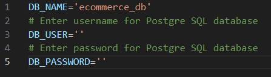
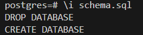
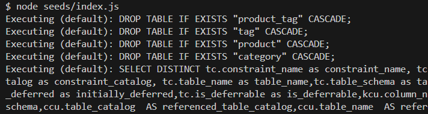

# E-commerce Back End

## Description

This project takes a PostgreSQL database with a working Express.js API and creates the back end using Sequalize. The database stores product, category, and tag information for an e-commerce site. 

- The back end for the database supports requests to view all products, categories, and tags, as well as, view specific items for each or add, update, and delete.
- The most challenging part of this project was determining if associatons between models should be defined in their individual files or within the through model executions.  Sequalize was intitially creating additional unique keys that I did not want.
- If the application had a front end, then I would develop middleware to provide more specific responses to the user for when server requests are completed or not completed.
- For future development, I would do further testing to understand if I've made redundant assocations between models and double check that the default on delete behaviors are best suited for this type of database.  

## Table of Contents

- [Installation](#installation)
- [Usage](#usage)
- [Credits](#credits)
- [License](#license)
- [Questions](#questions)

## Installation

This application requires a runtime environment with Node.js and PostgreSQL installed.  With Node.js installed, clone the GitHub repository, then install dependencies in the project directory by running the following code in the terminal: npm install

Once you have a local version of the repository.  Rename the .env.EXAMPLE file to .env and edit the file to input your username and password for your PostgreSQL database. 

  

Lastly, in a terminal navigate to the e-commerce-back-end/db/ directory in the local repository and sign into your PostgreSQL database executing this line of code psql -U postgre.  Proceed to authenticate with your password.

Then, initiate the schema.sql file for the database by executing: \i schema.sql

  

I recommend seeding the database with some example data by navigating back to the root directory of the repository and executing: node seeds/index.js

  

## Usage

Here is the [Code Repository](https://github.com/briandwach/e-commerce-back-end) and a video demonstration of the application can be viewed [HERE](https://drive.google.com/file/d/11Nwy8SGAwQe2SQnKgkuK2kXKJx3Yfeq4/view?usp=sharing).

This application is ran in a terminal with Node.js installed.  When in the root directory of the project, run the following code in the terminal: node server.js

The server will then be running locally and listening for requests.  

## Credits
The starting source code for this project was provided by the Northwestern Coding Bootcamp's [NU-VIRT-FSF-PT-12-2023-U-LOLC GitLab Repository](https://git.bootcampcontent.com/Northwestern-University/NU-VIRT-FSF-PT-12-2023-U-LOLC/-/tree/main/13-ORM/02-Challenge/Develop?ref_type=heads)

## License
This application is covered under the [MIT License](http://choosealicense.com/licenses/mit/).

## Questions
Please email me with any questions regarding this application at: brian.d.wach@gmail.com

Additionally, checkout more of my work on GitHub: [briandwach](https://github.com/briandwach)